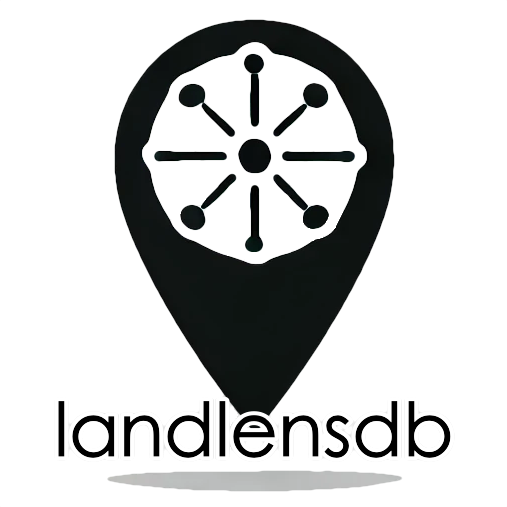

# landlensdb Documentation

[](https://pypi.org/project/landlensdb/)
[](https://hub.docker.com/r/landlensdb/landlensdb)
[](https://github.com/landlensdb/landlensdb/graphs/contributors)
[](https://pepy.tech/project/landlensdb)
[](https://github.com/landlensdb/landlensdb/actions/workflows/main.yml)


<p align="center">
  
</p>

**Geospatial image handling and management with Python and PostgreSQL**

## Overview
`landlensdb` helps you manage geolocated images and integrate them with other spatial data sources. The library supports:

- Image downloading and storage
- EXIF/geotag extraction
- Road-network alignment
- PostgreSQL integration

This library is designed to support workflows process large sets of georeferenced images.

## Features
- **GeoImageFrame**: Download, map, and convert geolocated images into a GeoDataFrame-like structure.
- **Mapillary API Integration**: Fetch and analyze images with geospatial metadata.
- **EXIF Data Processing**: Extract geolocation, timestamps, and orientation from image metadata.
- **Database Operations**: Store image records in PostgreSQL; retrieve them by location or time.
- **Road Network Alignment**: Snap image captures to road networks for precise route mapping.

## Examples
The examples below are Jupyter notebooks and can help you get started!

- [Getting Started](examples/getting-started.ipynb)
- [Working with Mapillary](examples/mapillary.ipynb)

To install Jupyter with pip:

```python
pip install jupyter
```

## Attribution